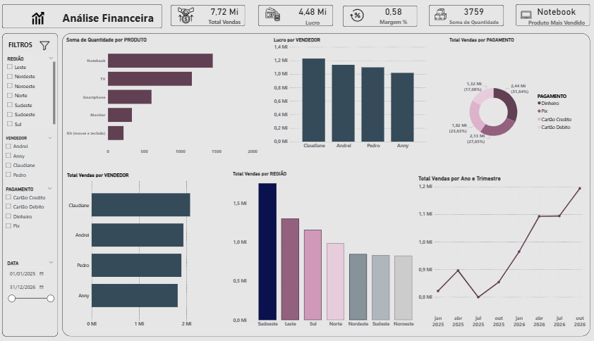
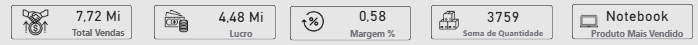
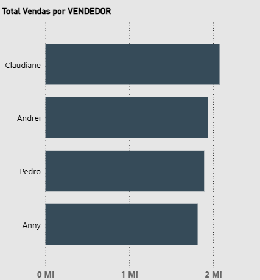
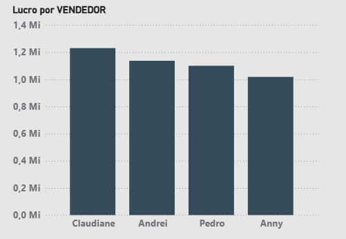
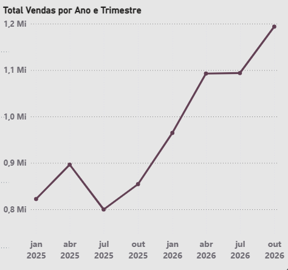
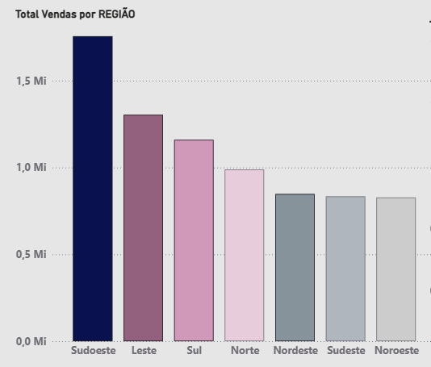
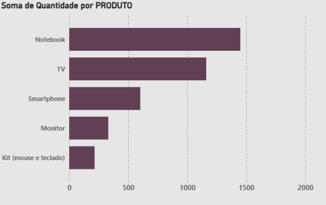
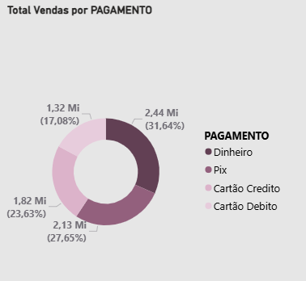

# 📊 Dashboard de Vendas — Power BI 📊

**Sobre:**  
Um projeto de análise sobre o desempenho de vendas de uma empresa fictícia, criado para demonstrar habilidades em modelagem de dados, DAX e extrair insights acionáveis. Contém KPIs, evolução temporal, ranking de produtos, distribuição por forma de pagamento e desempenho por vendedor/região. 

---
**Objetivos:**
* Acompanhar o progresso em relação às metas de vendas.
* Identificar os produtos e regiões com melhor e pior desempenho.
* Analisar o desempenho individual dos vendedores.

**Tecnologias Utilizadas:**
* Microsoft Power BI
* Excel

---
## 🔎 Conteúdo do repositório
-  Arquivo do Power BI: `DASHBOARD.pbix`  
-  Arquivo do Excel, usada como base de dados: `vendas_sample.csv` 
- Screenshots do dashboard.
- Este arquivo: `README.md`

## 🧭 Principais visualizações
- KPIs: Total Vendas, Lucro, Margem %, Quantidade Vendida, Produto mais vendido.  
- Evolução: Vendas por mês.
- Distribuição: Vendas por forma de pagamento (pizza).  
- Performance por vendedor e por região (barras).

## 🖼️ Visualização do Dashboard
 
## Cartões:

## Gráficos de Vendas:

## Gráfico de Quantidade do Produto:

## Gráfico de Vendas por Pagamento:

## 💡 Principais insights
- **Produto mais vendido:** `Notebook` (1450 unidades).  
- **Forma de pagamento principal:** `Dinheiro` (2.442.123,84 R$).  
- **Região com maior faturamento:** `<Sudoeste>` (1.755.800,92 R$).
- **Vendedor com maior lucro:** `<Claudiane>` (1.229.839,66 R$) 

 ## 🛠 Skills demonstradas
- Power BI Desktop, Power Query, DAX (medidas), visualização de dados, storytelling com dados.

## ⚙️ Como abrir / reproduzir
1. Faça o download/clonagem do repositório.  
2. Abra `DASHBOARD.pbix` no Power BI Desktop.  
3. Se necessário, em **Transformar Dados** atualize a fonte para `vendas_sample.csv`.  
4. Para testar filtros, use os slicers de Data, Região e Vendedor.

## ✉️ Contato
`<Wemili Maria>` — `<wemilimaria1@gmail.com>`  
LinkedIn: `<https://www.linkedin.com/in/wemili-maria-85a02a387/>`

